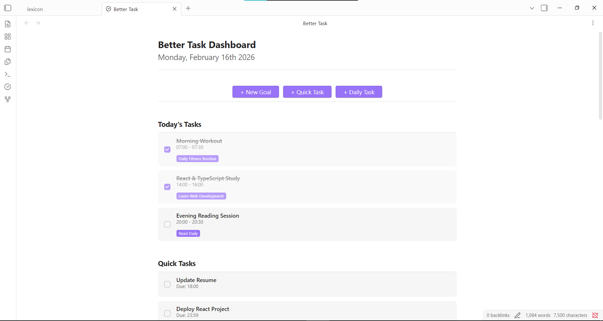
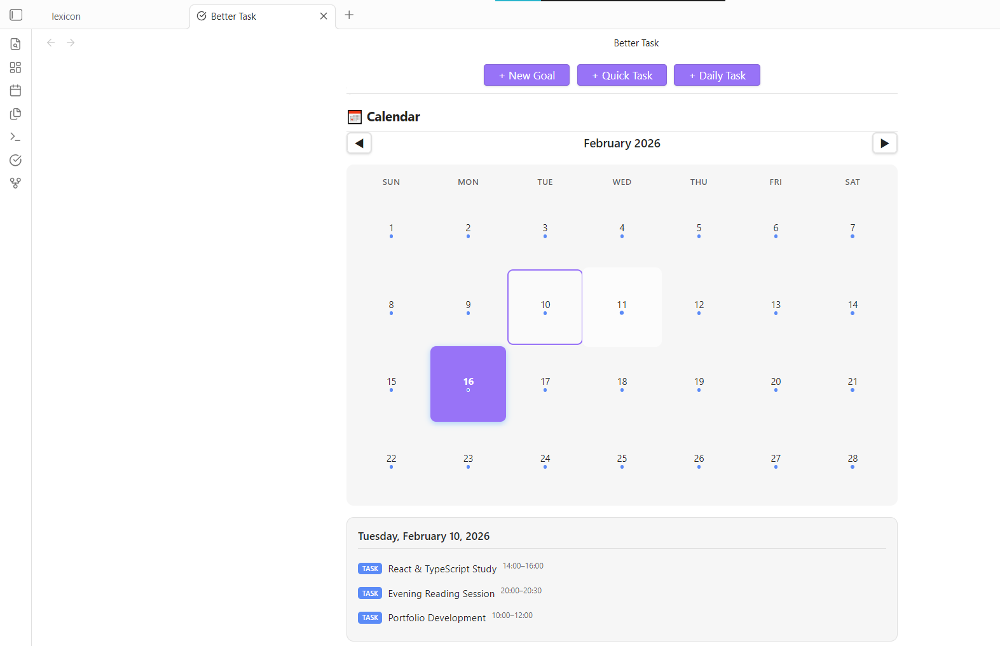
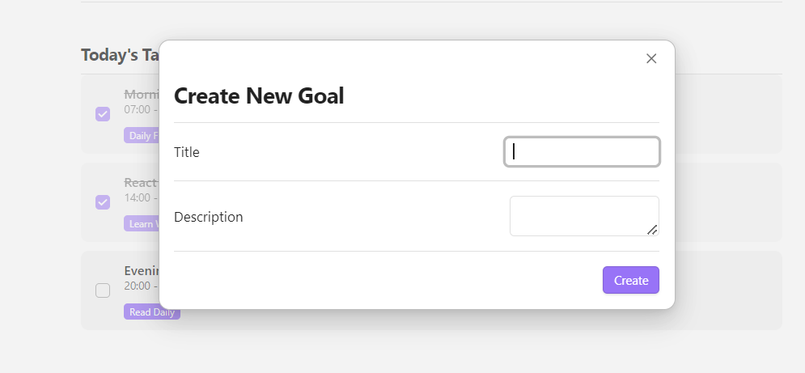
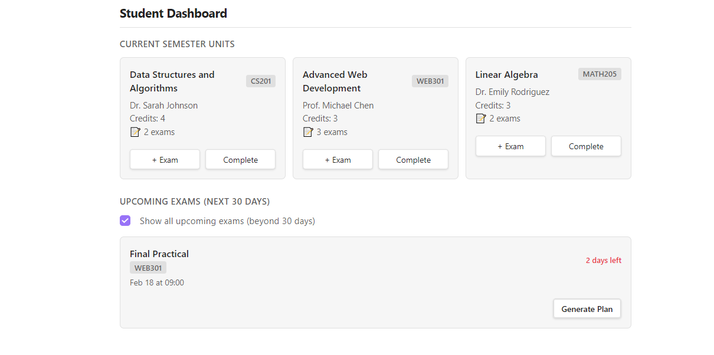
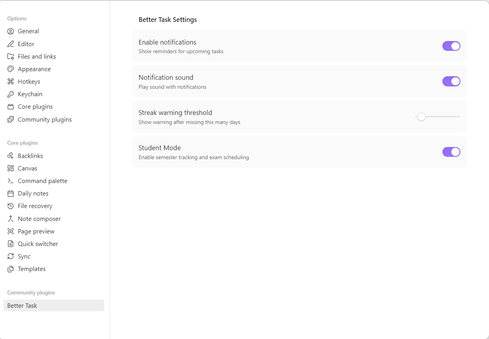

# Better Task

A better task management plugin for Obsidian. Organize your work with **goals**, **tasks**, and an at-a-glance **dashboard**—with optional **notifications**, **analytics**, and **Student Mode** for courses and exams.

---

## What Better Task Does

- **Goals** — Define goals and track progress. Each goal can have daily or one-off tasks.
- **Dashboard** — One place to see today’s tasks, quick tasks, goals, and (if enabled) your units and upcoming exams.
- **Notifications** — Get reminded about due or overdue tasks (in-app and optional system notifications).
- **Analytics** — Weekly completions, streaks, a 30-day activity heatmap, and advanced insights (consistency, momentum, predictions).
- **Student Mode** — Add units/courses and exams, then generate study tasks automatically before exam dates.

*Screenshot of the main Better Task dashboard.*

---

## How to Use It

### Opening the Dashboard

- Use **Command Palette** (`Ctrl/Cmd + P`) → type **“Open Dashboard”** → run **Better Task: Open Dashboard**.
- Or open the **Better Task** view from the right sidebar (ribbon icon, if enabled).

*Screenshot of Command Palette with “Open Dashboard” selected.*

---

### Creating Goals and Tasks

1. **Create a goal**  
   From the dashboard, click **New Goal**, or use Command Palette → **Better Task: Create New Goal**. Enter a name and optional details.

2. **Add tasks to a goal**  
   - **Daily tasks** — Repeat every day (or on a schedule). Use **Create Daily Task** from the dashboard or Command Palette.  
   - **Quick tasks** — One-off tasks. Use **Create Quick Task** or the equivalent button on the dashboard.

3. **Complete tasks**  
   Check off tasks from the dashboard. Your completions feed into analytics and streaks.

*Screenshot of creating a goal and adding tasks.*

---

### Using Student Mode (Optional)

If you use Obsidian for study and exams:

1. **Enable Student Mode**  
   Go to **Settings → Better Task** and turn on **Student Mode**.

2. **Add units (courses)**  
   Use **New Unit** on the dashboard or **Better Task: Create Unit/Course**. Enter unit name, code, semester, and other details.

3. **Add exams**  
   For each unit, use **Add Exam** to set exam date, time, location, and topics.

4. **Generate study tasks**  
   For an upcoming exam, click **Generate Study Tasks**. The plugin creates tasks for each topic, spread over the days before the exam.

*Screenshot of Student Mode section (units and upcoming exams).*

---

### Settings

In **Settings → Better Task** you can:

- **Enable / disable notifications** (in-app and system).
- **Notification sound** (when supported).
- **Streak warning threshold** — how many days before you get a streak warning (1–30).
- **Student Mode** — turn the units/exams and study-task features on or off.

*Screenshot of Better Task settings.*

---

### Undo and Redo

- **Undo:** `Ctrl/Cmd + Z`  
- **Redo:** `Ctrl/Cmd + Shift + Z`  

Use these after creating or completing goals or tasks to step back or forward.

---

## Summary

| What you want to do        | How to do it                                      |
|---------------------------|---------------------------------------------------|
| See everything at a glance | Open Dashboard (Command Palette or sidebar)       |
| Create a goal              | New Goal on dashboard or **Create New Goal**     |
| Add a repeating task       | Create Daily Task                                |
| Add a one-off task         | Create Quick Task                                |
| Track courses and exams    | Enable Student Mode → New Unit → Add Exam        |
| Get reminders              | Enable notifications in Settings → Better Task   |
| View stats and streaks     | Check the Analytics and Advanced Analytics on the dashboard |

---

